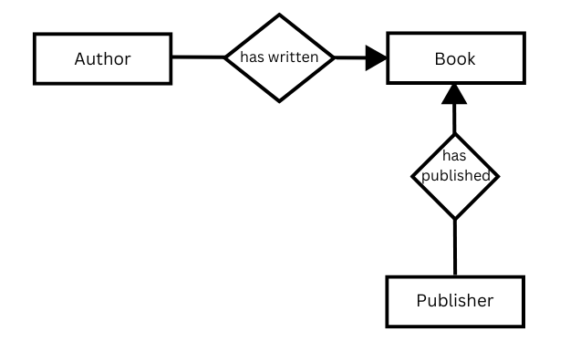

::: questions 

- Was ist ein Metadatenstandard?
- Was ist ein Metadatenschema?
- Was ist ein Modell?

:::

::: objectives

Nach Beendigung dieser Episode sollten Teilnehmende in der Lage sein,

- die Unterschiede zwischen den Begriffen *Metadatenstandard*, *Metadatenschema* und *Metadatenmodell* anhand von zentralen Aspekten wiederzugeben.   

:::

## Standard, Schema oder Modell?

Die Begriffe *Metadatenstandard*, *Metadatenschema* und *Metadatenmodell* werden oft synonym verwendet. 
Im Folgenden wird versucht, zwischen den Begriffen zu differenzieren. Es muss jedoch betont werden, dass dies kein universeller Anspruch ist; vielmehr soll es ein besseres Verständnis der Strukturen der Datenstandardisierung ermöglichen, da es keine allgemein akzeptierten Definitionen dieser Begriffe gibt.

## Metadaten-Standard

Ein Metadatenstandard ist eine technische Spezifikation, die beschreibt, wie Daten erfasst oder strukturiert werden sollten. Es gibt verschiedene Möglichkeiten, Daten zu standardisieren. Zwei der wichtigsten Konzepte werden in dieser Lektion vorgestellt. Zum einen wird jedes Element oder Datenfeld eindeutig benannt (z. B. Autor, Titel usw.) und kann durch Regeln in Form von Attributen (z. B. Datentyp) spezifiziert werden. Andererseits kann eine Struktur für die Erfassung der Daten in Form von Gruppen oder Kategorien definiert werden, z. B. administrative, technische und beschreibende Metadaten. Beide Methoden liefern eine grundlegende Beschreibung und Organisation der Daten und standardisieren sie dadurch. Natürlich ist auch eine Kombination der beiden Methoden möglich.

Für verschiedene Themen und Fachgebiete gibt es unterschiedliche Standards. Damit wird sichergestellt, dass z.B. die Regeln für die Erfassung von Daten in einem Archiv oder einer Bibliothek berücksichtigt werden. Das Provenienzprinzip in Archiven oder das Pertinenzprinzip in Bibliotheken lassen sich auf diese Weise abbilden.

#### Beispiel

Struktur der Metadaten:

* Administrative Metadaten
* Beschreibende Metadaten
* Strukturelle Metadaten
* Technische Metadaten

Metadaten-Elemente:

* Ersteller
* Herausgeber
* Datum
* Rechte
* Paginierung
* Dateiformat
* Titel

Metadatenelemente innerhalb einer Struktur:

* Administrative Metadaten
  * Herausgeber
  * Rechte
* Beschreibende Metadaten
  * Ersteller
  * Datum
  * Titel
* Strukturelle Metadaten
  * Paginierung
* Technische Metadaten
  * Dateiformat
 

## Metadaten-Schema

Ein *Metadatenschema* wird meist zur Strukturierung von Daten in einem bestimmten Kontext verwendet, und es gibt unzählige Standards für jede Disziplin oder einen spezifischen Zweck. Während der Entwicklungsphase der Datenstruktur kann zudem ein vorhandener Metadatenstandard integriert werden. So wird der, in der folgenden Episode behandelte, Dublin Core Standard oft als Grundlage genutzt, um dessen Felder in ein spezifisches Modell zu übernehmen.   

Stellen Sie sich vor, Sie möchten das Foto eines Gebäudes beschreiben. In den Metadaten haben Sie ein Element namens „creator“. Welchen Namen würden Sie hier eingeben? Den des Fotografen oder den des Architekten? Hier können Sie „Rolle“ als Metadatenelement hinzufügen, um den Kontext der personenbezogenen Daten weiter zu beschreiben. Möglicherweise möchten Sie auch die Daten für das Foto und das abgebildete Gebäude getrennt strukturieren, um die Informationen korrekt anzuzeigen. Ein Schema kann eine benutzerdefinierte Struktur oder die Hierarchie einer Sammlung abbilden sowie Datenfelder für bestimmte Themen definieren. Ein Schema stellt die Daten also in einen gewünschten Kontext und legt die Beziehungen zwischen den enthaltenen Informationen fest.

## Konzeptionelles Modell

*Konzeptionelle Modelle*, auch semantische Datenmodelle genannt, sind in der Regel Abstraktionen von realen Entitäten. Sie werden verwendet, um die Daten einer Sammlung oder eines spezialisierten Bereichs auf abstrakte Weise formal zu erfassen. Ein Beispiel für ein solches Modell ist das Entity-Relationship-Modell, das die Beziehung zwischen zwei Datenentitäten beschreibt. 
Zum Beispiel kann die Beziehung zwischen der Entität des Autors „Franz Kafka“ und der Entität des Buches „Der Prozess“ durch die Beziehung „hat geschrieben“ definiert werden.  
Der Vorteil dieser Beziehung ist, dass sie eine flexible Verknüpfung von Daten ermöglicht. Darüber hinaus kann die Entität „Buch“ mit der Entität "Verlag" über die Beziehung „hat veröffentlicht“ verknüpft werden.

{alt='Abbildung der Entitätsbeziehungen in einem konzeptionellen Modell, mit Triples zur Verknüpfung von Daten'}  

Im konzeptionellen Modell werden die Daten in Form von Tripeln modelliert. Ein Tripel besteht aus einem Subjekt, einem Objekt und einem Prädikat. Das Prädikat beschreibt die Beziehung zwischen dem Subjekt, der zu beschreibenden Entität, und dem Objekt (der mit dem Subjekt verbundenen Entität):

Autor (Subjekt) hat geschrieben (Prädikat) Buch (Objekt).  

Ein Objekt kann das Subjekt eines anderen Tripels werden und umgekehrt, wie das obige Beispiel zeigt. 

Dieser Ansatz wird hauptsächlich im Semantic Web verwendet, wo er als Grundgerüst für verknüpfte offene Daten (Linked Open Data) dient. Linked Open Data (LOD) zielen darauf ab, ein Höchstmaß an Verknüpfung zwischen Datensätzen zu erreichen. Entitäten werden in diesem Zusammenhang mit eindeutigen Bezeichnern in den Metadaten versehen, die wiederum Entitäten darstellen, die über eigene Metadaten verfügen. Zur Veranschaulichung: Eine Entität kann durch ihren Bezeichner im Kontext der Wissensdatenbank der Wikimedia Foundation, bekannt als "Wikidata", beschrieben werden. Durch die Herstellung dieser Verknüpfungen werden die in diesem Zusammenhang verfügbaren Daten indirekt genutzt. Wie dies praktisch aussieht, erfahren Sie in der Episode zu RDF. 

::: challenge

### Übung 

Diskutiert das folgende Diagramm in kleinen Gruppen. Was wird gezeigt? Wie werden Daten miteinander verknüpft? Fallen euch weitere Daten ein, die man verlinken könnte?   

{alt='Figure of Exercise on Data Relations'}

::: solution

### Lösung
Nicht nur der Name des Autors ist als Entität enthalten, sondern auch sein GND-Datenbank-Identifikator. 
Die Gemeinsame Normdatei (GND), die von der Deutschen Nationalbibliothek verwaltet wird, ist eine umfassende Datenbank, die Personen, Körperschaften, Konferenzen, Geografien, Sachgebiete und Werke beschreibt. Innerhalb der GND ist die Entität Autor auch eine Metadaten-Entität, die biografische Daten enthält. Durch die Verknüpfung dieser beiden Entitäten werden ihre Daten in einem einzigen Datensatz zusammengefasst, so dass keine separaten Datensätze mehr erforderlich sind. Die Veröffentlichung hat ebenfalls einen Datensatz in der GND-Datenbank, und diese Entität ist mit allen Metadaten verknüpft, die mit der Veröffentlichung verbunden sind, wie z.B. das Erscheinungsjahr. In diesem Beispiel hat der Verlag eine eigene Entität in Form eines Wikidata-Datensatzes, mit dem er verknüpft ist. Die Metadaten in dieser Entität enthalten Informationen über den Standort des Verlags, die mit einem Identifikator verknüpft sind. In diesem Beispiel ist dies die TGN-ID. Der Getty Thesaurus of Geographic Names (TGN) dient als Standarddatenbank für geografische Namen, in der verschiedene Schreibweisen, einschließlich historischer Schreibweisen, sowie Koordinaten und Länderzugehörigkeit neben anderen Attributen erfasst werden. Auf diese Weise entsteht ein Datennetz, das je nach Verfügbarkeit der Daten nach Bedarf erweitert werden kann. Es gibt viele andere Normdaten, kontrollierte Vokabulare und Thesauri, die Informationen über Entitäten wie Objekte, Vokabeln, Begriffe usw. liefern. Sie alle können verwendet werden, um das Netzwerk zu einem Graphen zu erweitern.

:::
:::

    
::: callout 

#### Standards für Datenwerte  

Diese Standards stellen kontrollierte Vokabulare, Thesauri (hierarchische Listen verwandter Begriffe) und Normdaten (Listen standardisierter Namen oder Begriffe für Entitäten wie Autoren, Künstler oder Organisationen) bereit, um die Konsistenz der zur Beschreibung von Ressourcen verwendeten Begriffe zu gewährleisten (z. B. Getty Art & Architecture Thesaurus, Virtual International Authority File - VIAF).  
Wertestandards sind unerlässlich, um die Auffindbarkeit zu verbessern und sicherzustellen, dass Metadatensätze über verschiedene Datensätze und Systeme hinweg konsistent und genau sind.
:::  

Sammlungen des kulturellen Erbes zeichnen sich häufig durch eine große Heterogenität in Bezug auf Inhalt, Alter, Retrodigitalisierungsmethoden und damit verbundene Datenerfassungsprozesse aus. Auch Art und Umfang der erfassten Metadaten sind in den einzelnen Sammlungen sehr unterschiedlich. Unterschiede bei der Datenerfassung und -speicherung tragen ebenfalls zu dieser Heterogenität bei. Das Ziel der Konsolidierung von Sammlungen in Online-Portalen zur Verbesserung der Sichtbarkeit und Zugänglichkeit erfordert jedoch eine weitestgehende Standardisierung der Daten. Diese hilft auch der Forschung, die Vergleichbarkeit einer großen Anzahl von Objekten zu gewährleisten. Die Standardisierung großer Datenmengen aus unterschiedlichen Sammlungen ist zeit-, kosten- und personalaufwändig, und diese Ressourcen sind oft knapp. Aus diesem Grund wurden in den letzten Jahren Mindestanforderungen an Metadaten diskutiert. Ein in Deutschland entwickelter Mindestdatensatz wird im Folgenden vorgestellt.  

::: keypoints  
Die Begriffe Metadatenstandard, Metadatenschema und Metadatenmodell werden häufig synonym verwendet. Sie lassen sich grob wie folgt unterscheiden:
 - Ein Metadatenstandard beschreibt die Elemente oder die Struktur von Metadaten und ist hauptsächlich für die technische Umsetzung definiert.
 - Ein Metadatenschema bietet eine Struktur für Metadaten innerhalb eines bestimmten Inhalts, wobei häufig bestehende Metadatenstandards integriert werden.
 - Ein Metadatenmodell ist ein abstraktes und theoretisches Modell, das Metadaten in ihrem Kontext beschreibt.
:::

